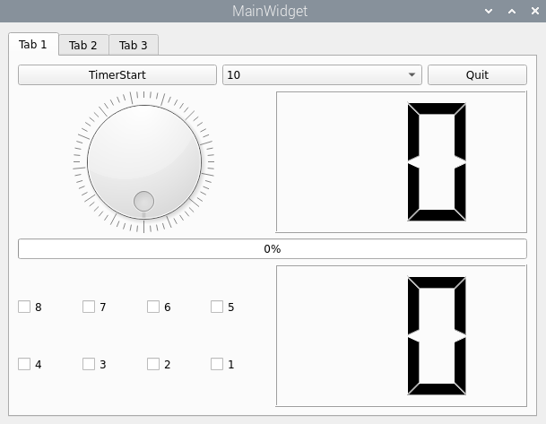

# Qt 기반 Aiot 애플리케이션

이 애플리케이션은 라즈베리파이와 같은 임베디드 환경에서 [디바이스 드라이버(ledkey_poll_dev.c)](https://github.com/KimMS-99/IntelAISW_LinuxBsp/blob/main/DeviceDriver/p432_ledkey_poll/ledkey_poll_dev.c)를 이용해 LED 및 버튼(Key)을 제어하고, 소켓 통신을 통해 [서버(iot_server.c)](https://github.com/KimMS-99/C_CPP/blob/main/Tcp%3AIp/iot_server/iot_server.c)와 연결하여 데이터를 주고받기 위해 만든 예제이다.

## 사전 준비 사항

이 Qt 애플리케이션을 실행하기 전에, 타겟 보드(라즈베리파이)에서 다음 작업이 반드시 선행되어야 함.

1.  **커널 모듈 적재**: 컴파일된 디바이스 드라이버 파일(`ledkey_poll_dev.ko`)을 커널에 로드.
    ```bash
    sudo insmod ledkey_poll_dev.Ko
    ```

2.  **디바이스 파일 생성**: 애플리케이션이 드라이버와 통신할 수 있도록 `/dev` 디렉토리에 캐릭터 디바이스 파일을 생성. 이때 주 번호(Major Number)는 드라이버 코드에 명시된 `230`을 사용해야 함.
    ```bash
    sudo mknod /dev/ledkey c 230 0
    ```

3.  **서버 실행**: 소켓 통신을 위해 라즈베리파이에서 서버 프로그램을 실행해야 합니다. (예: `./iot_server 5000`)

위 과정이 정상적으로 완료되어야만 본 애플리케이션이 `/dev/ledkey` 파일을 통해 하드웨어를 제어가능.

## 핵심 클래스

[`LedKeyDev`](../../docs/Markdown/) 클래스

[`tab1devcontrol`](../../docs/Markdown/tab1.md) 클래스<br>


[`sockclient`](../../docs/Markdown/sockclient.md) 클래스<br>

[`tab2socketclient`](../../docs/Markdown/tab2.md) 클래스<br>
;

[`tab3controlpannel](../../docs/Markdown/tab3.md) 클래스 <br>
