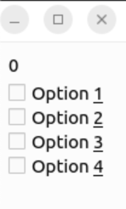
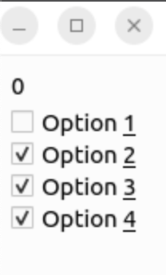

# QCheckBox 위젯

**체크 박스(Check Box)**는 사용자로부터 복수 옵션을 동시에 입력받을 때 사용된다. 체크 박스는 일반적으로 하나씩 따로 사용되지만, 라디오 버튼과 마찬가지로 여러 체크 박스를 **QButtonGroup**클래스를 이용해서 하나의 그룹으로 묶어서도 사용할 수 있다. **QButtonGroup** 클래스의 **buttonClicked(int)** 시그널을 이용하면 여러 개의 체크 박스 객체들을 쉽게 관리할 수 있다.

**QCheckBox** 위젯을 이용해서 각각의 버튼을 만들고 버튼이 선택되는 것을 확인하기 위해서는 **checked()** 시그널을 각각의 버튼에 연결하여 사용할 수 있다. 하지만 버튼의 수가 많아지면 연결되는 시그널과 슬롯의 수가 많아지게 되고 연결과 관리가 불편하다. 이러한 문제는 체크 박스들을 그룹으로 묶어서 사용하면 해결할 수 있다.

***CheckBox.cpp**코드를 보면 **QButtonGroup** 클래스응 기본적으로 상호 베타적(exclusive)으로 동작한다. 체크 박스를 버튼 그룹으로 묶을 때는 각각의 버튼들이 따로 동작될 수 있도올 **QButtonGroup** 클래스의 **setExclusive()** 메소드에 **false** 옵션을 설정해주어야 한다.

코드를 실행해보면 체크 박스가 표시되는데 체크 박스를 선택하면 레이블에 선택한 버튼의 ID가 표시된다. 버튼 선택 시 ID를 제대로 표시하려면, 버튼을 그룹에 추가할 때 **addButton()** 메소드의 두 번째 인자의 값을 제대로 설정해야 한다. 두 번째 인자의 기본값은 -1이기 때문에, 버튼의 ID를 명시해주지 않으면 제대로 표시되지 않으니 주의.

+ ***실행 결과*** 

#### 시그널과 슬롯의 연결

시그널과 슬롯을 연결할 때는 값을 넘길 수는 없고, ***CheckBox.cpp**와 같이 서로 넘어가는 인자형만 지정할 수 있다. 시그널과 슬롯의 인자의 형은 같아야 하며 다른 경우에는 연결되지 않으므로 주의해야 한다. 일반적으로 시그널의 인자 수가 슬롯보다 많을 때는 문제가 없지만, 슬롯의 인자 수가 시그널의 인자 수보다 많은 경우에는 빌드 시 에러가 발생한다.
