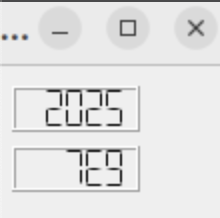

# QLCDNumber 위젯

**QLCDNumber** 위젯은 디지털 전자시계 같은 LCD 형태로 10진수, 16진수 등의 숫자나 온도 등의 숫자값을 표시하기 위해 사용된다.

**QLCDNumber** 위젯은 숫자를 2진수(Bin), 10진수(Dec), 8진수(Oct), 16진수(Hex) 모드로 표시할 수 있으며, 모드 변환 메소드를 이용하면 현재의 값을 해당 진수의 값으로 자동 변환할 수 있다.

+ ***실행 결과*** 

