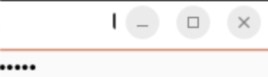

# QLineEdit 위젯

**QLineEdit** 위젯은 한 줄의 문자열을 입력받기 위해 사용된다.

입력 문자열을 입력하면 **QLineEdit** 위젯을 통해서 다시 사용자에게 보여지는데 이때 출력하는 모드(에코 모드)와 관련하여 여러 옵션을 제공한다.

+ ***QLineEdit 위젯의 에코 모드***

| 옵션 | 내용 | 비고
|:---:|:---:|:---:|
|Normal|입력받은 문자열을 그대로 출력한다. | 디폴트 옵션 값
| NoEcho | 입력받은 문자열을 화면에 표시하지 않는다. | |
| Password | 입력받은 문자를 '*'기호로 바꾸어 출력한다 | |
| PasswordEchoOnEdit | 입력받을 때 정상적으로 화면에 표시되다가 입력이 끝나면 '*'기호로 표시한다. | Qt 4.2부터 제공|

에코 모드에 따라서 입력된 값을 표시하는 형태가 달라진다. **PasswordEchoOnEdit** 옵션은 입력할 때는 정상적인 문자로 표시되지만, 포커스를 잃으면 입력된 문자가 '*'로 변경되어서 표시된다.

+ ***실행 결과*** 

