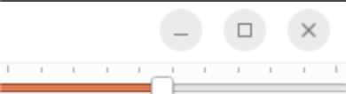

# QSlider 위젯

**QSlider** 위젯은 수직 또는 수평의 슬라이더를 제공하는데, 슬라이더의 핸들(Handle)을 이동시키고 이 비율을 이용해 숫자값을 입력하거나 표시할 수 있다.

슬라이더는 키보드의 방향키 및 마우스의 휠을 통해 값을 설정할 수 있다. 값을 보다 세세히 구분할 수 있도록 틱 표지(Ticj Mark)를 사용할 수 있는데, 슬라이더의 방향에 따라서 상하 방향이나 좌우 방향 등으로 표시되도록 설정할 수 있다.

+ **실행 결과** 
