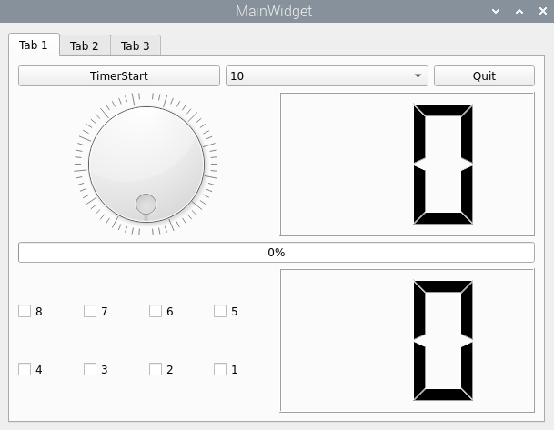
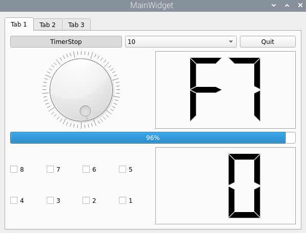
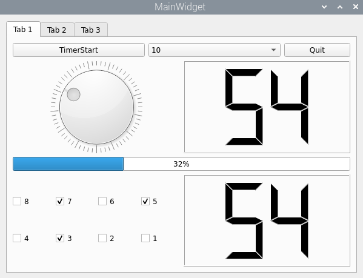

# Aiot tab1

## ⦁ `Tab1DevControl` 클래스 (`tab1devcontrol.h`, `tab1devcontrol.cpp`)

`Tab1DevControl` 클래스는 사용자 인터페이스(UI)의 실제 동작을 정의하고, `LedKeyDev`를 통해 하드웨어를 제어함.

-   **UI 요소 초기화**: 생성자에서 다이얼, 프로그레스 바, 체크박스(Key 상태 표시용), 타이머 등 UI 위젯들을 초기화하고 `LedKeyDev` 객체를 생성.
-   **시그널-슬롯 연결**: Qt의 시그널-슬롯 메커니즘을 사용하여 UI 이벤트와 처리 함수를 연결.
    -   `pDialLed` (다이얼)의 값이 바뀌면 -> `pLedKeyDev->writeLedDataSlot`을 호출하여 LED 상태를 변경.
    -   `pLedKeyDev`로부터 `updateKeyDataSig` (버튼 입력) 시그널이 오면 -> `updateCheckBoxKeySlot`을 호출하여 UI의 체크박스 상태와 LCD 숫자를 업데이트.
    -   UI의 체크박스를 직접 클릭하면 -> `updateCheckBoxMouseSlot`을 호출하여 LED 상태를 변경.
    -   타이머(`pQTimer`)가 만료되면 -> `updateDialValueSlot`을 호출하여 다이얼 값을 자동으로 증가.
-   **상태 관리**: `lcdData` 변수를 통해 현재 LED 및 Key 상태를 비트 연산으로 관리하고, 이를 LCD Number 위젯에 표시.

### ⦁ `MainWidget` 클래스 (`mainwidget.cpp`)

애플리케이션의 메인 윈도우 역할.

-   `Tab1DevControl`의 인스턴스를 생성하여 탭 위젯(`pTab1`)에 추가하고, 레이아웃을 설정하여 화면에 표시.

### ⦁ 전체 동작 흐름

1.  **애플리케이션 시작**: `MainWidget`이 생성되고, 그 안에 `Tab1DevControl` 위젯이 로드.
2.  **디바이스 드라이버 연동**: `Tab1DevControl`은 `LedKeyDev` 객체를 생성하고, `LedKeyDev`는 `/dev/ledkey` 디바이스 파일을 연다.
3.  **LED 제어 (출력)**:
    -   사용자가 UI의 다이얼(`pDialLed`)을 돌리거나 체크박스를 클릭.
    -   연결된 슬롯(`updateProgressBarLedSlot`, `updateCheckBoxMouseSlot`)이 호출.
    -   `pLedKeyDev->writeLedDataSlot`을 통해 해당 값이 디바이스 드라이버로 전달.
    -   드라이버는 전달받은 값으로 실제 LED의 ON/OFF 상태를 변경.
4.  **Key 입력 처리 (입력)**:
    -   사용자가 하드웨어 버튼을 누른다.
    -   디바이스 드라이버가 인터럽트를 통해 이를 감지하고, `/dev/ledkey` 파일에 키 정보를 기록.
    -   `QSocketNotifier`가 데이터가 있음을 감지하고 `activated` 시그널을 보냄.
    -   `LedKeyDev`의 `readKeyDataSlot`이 호출되어 키 값을 읽고, `updateKeyDataSig` 시그널을 발생.
    -   `Tab1DevControl`의 `updateCheckBoxKeySlot`이 이 시그널을 받아 UI(체크박스, LCD)를 업데이트하고, 동시에 해당 키 값으로 LED 상태도 변경.

이처럼 Aiot 애플리케이션은 **UI(Qt) ↔ `LedKeyDev` ↔ 디바이스 드라이버 ↔ 하드웨어(LED/Key)** 의 구조로 명확하게 역할이 분리되어 있으며, Qt의 시그널-슬롯 메커니즘을 통해 각 컴포넌트가 효율적으로 상호작용한다.

+ **화면** 

