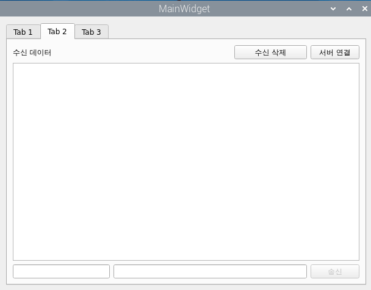
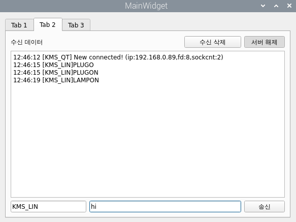

# Aiot tab2

`tab2socketclient`는 Qt 기반의 소켓 통신 클라이언트 UI 및 로직을 담당. [`SockClient`](./sockclient.md)라는 별도의 클래스를 통해 실제 소켓 통신을 처리하며, UI와의 상호작용을 관리한다.

## ⦁ `Tab2socketclient` 클래스 (`tab2socketclient.h`, `tab2socketclient.cpp`)

`Tab2socketclient` 클래스는 소켓 통신 UI의 실제 동작을 정의하고, `SockClient`를 통해 서버와 데이터를 주고받는다.

-   **UI 요소 및 소켓 객체 초기화**: 생성자에서 UI 위젯을 설정하고, 실제 소켓 통신을 담당할 `SockClient` 객체(`pSockClient`)를 생성한다. 초기에는 '송신' 버튼을 비활성화한다.
-   **시그널-슬롯 연결**: Qt의 시그널-슬롯 메커니즘을 사용하여 UI 이벤트와 처리 함수(슬롯)를 연결한다.
    -   `pPBserverConnect` (서버 연결 버튼)을 토글하면 -> `on_pPBserverConnect_toggled` 슬롯을 호출하여 서버에 연결하거나 연결을 해제한다.
    -   `pPBSend` (송신 버튼)을 클릭하면 -> `on_pPBSend_clicked` 슬롯을 호출하여 입력된 데이터를 서버로 전송한다.
    -   `pSockClient`로부터 `socketRevcDataSig` (데이터 수신) 시그널이 오면 -> `updateRecvDataSlot` 슬롯을 호출하여 수신된 데이터를 UI에 표시하고, 특정 메시지(`LED` 제어)를 파싱하여 처리한다.
    -   `ledWriteSig` 시그널을 정의하여, LED 제어 메시지 수신 시 이 시그널을 발생시켜 다른 컴포넌트(예: `Tab1DevControl`)가 LED 상태를 변경할 수 있도록 한다.
-   **상태 관리**: 서버 연결 상태(`pPBserverConnect`의 `checked` 상태)에 따라 '송신' 버튼(`pPBSend`)의 활성화/비활성화 상태를 관리한다.

## ⦁ `SockClient` 클래스 (참조)

`tab2socketclient.cpp`에서 사용되는 [`SockClient` 클래스](./sockclient.md)는 실제 소켓 통신 기능을 캡슐화한 것이다.

-   **`connectToServerSlot(bool&)`**: 서버에 연결을 시도한다.
-   **`socketClosedServerSlot()`**: 서버와의 연결을 닫는다.
-   **`socketWriteDataSlot(QString)`**: 서버로 데이터를 전송한다.
-   **`socketRevcDataSig(QString)` (Signal)**: 서버로부터 데이터를 수신했을 때 이 시그널을 발생시킨다.

## ⦁ 전체 동작 흐름

1.  **애플리케이션 시작**: `MainWidget`이 생성되고, 그 안에 `Tab2socketclient` 위젯이 로드한다.
2.  **서버 연결**: 사용자가 '서버 연결' 버튼을 클릭한다.
    -   `on_pPBserverConnect_toggled` 슬롯이 호출되고, `pSockClient->connectToServerSlot()`를 통해 서버에 연결을 시도한다.
    -   연결에 성공하면 버튼의 텍스트가 '서버 해제'로 바뀌고 '송신' 버튼이 활성화.
3.  **데이터 송신**:
    -   사용자가 수신자 ID(`pLErecvid`)와 보낼 데이터(`pLEsendData`)를 입력하고 '송신' 버튼을 클릭한다.
    -   `on_pPBSend_clicked` 슬롯이 호출된다.
    -   수신자 ID가 없으면 메시지 앞에 `[ALLMSG]`를, 있으면 `[수신자ID]`를 붙여 포맷을 맞추낟.
    -   `pSockClient->socketWriteDataSlot()`을 통해 포맷된 메시지를 서버로 전송하낟.
4.  **데이터 수신**:
    -   서버로부터 메시지가 도착하면, `pSockClient`가 이를 감지하고 `socketRevcDataSig` 시그널을 발생시킨다.
    -   `Tab2socketclient`의 `updateRecvDataSlot` 슬롯이 이 시그널을 받아 동작한다.
    -   수신된 메시지에 현재 시간을 붙여 UI의 수신 데이터 창(`pTErecvdata`)에 표시한다.
    -   만약 메시지가 LED 제어 명령어(`[KMS_QT]@LED@...`)이면, 이를 파싱하여 `ledWriteSig` 시그널을 발생시키고, 이 시그널에 연결된 다른 위젯(Tab1)이 LED를 제어하게 된다.

이처럼 `tab2socketclient`는 **UI(Qt) ↔ `SockClient` ↔ 네트워크(서버) ↔ 다른 클라이언트** 의 구조로 역할을 분리하여, UI 제어와 실제 통신 로직을 나누고 Qt의 시그널-슬롯을 통해 효율적으로 상호작용한다.

+ **화면** 

