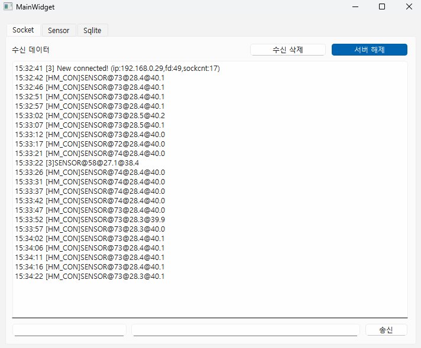
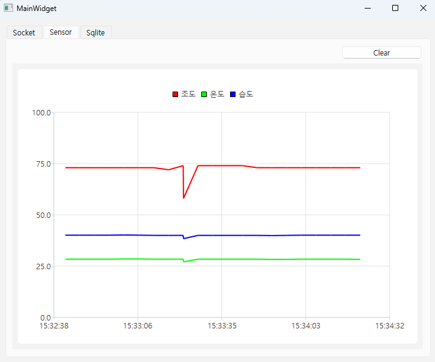
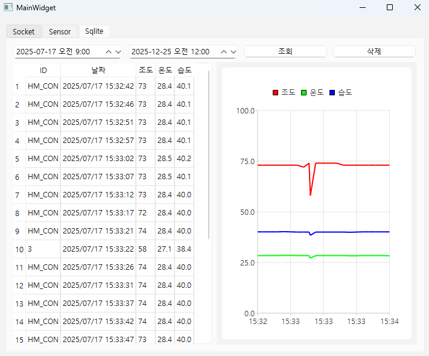

# IntelEdgeAISW 7기 7월 17일 Qt평가 문제

## Qt GUI 프레임워크를 활용한 센서 데이터 관리 시스템 구현

1. 프로그램 명은 SensorMan 메인윈도우 위젯은 Tab Widget 사용
2. 첫 번째 탭 화면에서는 iot 서버와 데이터 송/수신이 가능한 클라이언트 구현(Line Edit 더블클릭시 가상 키보드 구현)
3. 두 번째 탭 화면에서는 iot 서버에서 10초 단위로 수신된 조도/온도/습도 데이터를 실시간 라인차트 구현(데이터 수신 포맷 : [HM_CON]SENSOR@90@27.5@20.9)
4. 세 번째 탭 화면에서는 수신된 센서 데이터를 sqlite 데이터베이스를 활용하여 저장하고, 검색 기간별 데이터 조회 및 삭제 기능 구현, 조회된 센서데이터는 라인차트로 구현

- **실행 화면** 
 
 
 